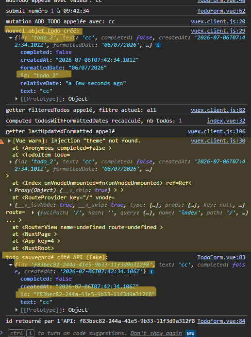
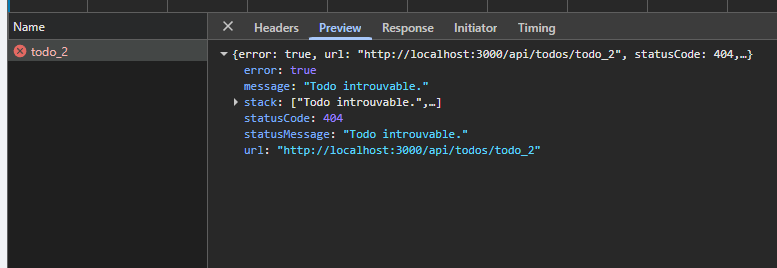

# Analyse du code existant

## Sommaire

1. [Technologies obsolètes / mal choisies](#tech-obsoletes)
   - [Vuex](#vuex)
   - [moment.js](#momentjs)
   - [lodash (import global)](#lodash-import)
   - [vue3-styled-components](#vue3-styled)
   - [Bootstrap 3.4.1 via CDN](#bootstrap-cdn)
2. [Anti-patterns Vue / Nuxt](#anti-patterns)
   - [ssr: false + dossier server/](#ssr-false)
   - [Styles inline dans les composants](#styles-inline)
   - [computed non purs](#computed-non-purs)
   - [Mutation directe de prop + v-model](#mutation-prop)
   - [Prop typée Object](#prop-object)
3. [Sécurité](#securite)
   - [v-html sur todo.text (XSS)](#vhtml-xss)
   - [window.**store** exposé](#window-store)
4. [Performance](#performance)
   - [lodash (bundle size)](#lodash-perf)
5. [Structure / lisibilité](#structure)
   - [!important généralisé](#important)
   - [console.log non nettoyés](#console-log)
   - [Strings en dur](#strings-dur)
   - [Dead code](#dead-code)
   - [TypeScript absent du front](#typescript-front)
6. [Bugs identifiés](#bugs)
   - [Reload direct crée des todos vides](#bug-reload)
   - [TOGGLE_TODO ne sync pas](#bug-toggle)
   - [Mismatch ID client/serveur](#bug-mismatch-id)

## 1. Technologies obsolètes / mal choisies <a id="tech-obsoletes"></a>

### Vuex <a id="vuex"></a>

Technologie obsolète, la lib n'a pas été mise à jour depuis plusieurs années. Aujourd'hui le state manager par défaut recommandé par l'équipe Vue est **Pinia**.

**Solution :** migrer vers Pinia, qui propose une API plus simple (pas de mutations séparées, tout passe par des actions), un meilleur support Typescript, et une meilleure intégration avec les devtools Vue 3.

### moment.js <a id="momentjs"></a>

Technologie obsolète (elle est même considérée legacy par son propre équipe) mais aussi très lourde.

**Solution :** la remplacer par une lib plus légère et maintenue, comme dayjs ou date-fns. Je proposerais dayjs, parce que la syntaxe reste très proche de moment.

### lodash (import global) <a id="lodash-import"></a>

Importer la totalité de lodash fait énormément augmenter la taille du bundle, alors qu'un seul projet de cette taille n'a besoin que de quelques fonctions.

**Solution :** j'ai audité chaque fonction lodash utilisée dans le projet pour voir lesquelles valent la peine d'être gardées (détail dans [docs/lodash-audit.md](./docs/lodash_audit.md)). Conclusion : la quasi-totalité a un équivalent natif JS aussi concis et performant, seule `_.countBy` reste légèrement plus lisible que son équivalent natif. Vu le faible nombre d'usages restants, je retirerais lodash complètement du projet.

### vue3-styled-components <a id="vue3-styled"></a>

Lib avec un historique quasi à l'arrêt (dernier commit il y a plusieurs années selon le repo GitHub), non maintenu activement. Elle est aussi mal implémentée ici : le `ThemeProvider` n'est jamais configuré dans l'app, ce qui génère un warning Vue "injection theme not found" à l'exécution. C'était l'intérêt principal de la lib, mais n'est jamais exploitée.

**Solution :** retirer cette dépendance et utiliser les `<style scoped>` natifs de Vue.

### Bootstrap 3.4.1 via CDN <a id="bootstrap-cdn"></a>

Ajoute un appel réseau pour importer la lib, qui en plus est une très vieille version (Bootstrap en est à la v5.x).

**Solution :** l'importer directement dans le projet, dans sa dernière version, ou la remplacer par une approche plus moderne (Tailwind par exemple).

## 2. Anti-patterns Vue / Nuxt <a id="anti-patterns"></a>

### `ssr: false` alors qu'il y a un dossier `server/` fonctionnel <a id="ssr-false"></a>

Le projet désactive complètement le rendu serveur (`ssr: false` dans `nuxt.config.js`), ce qui transforme l'app en SPA pure : le HTML initial servi est vide (`<div id="__nuxt"></div>`), tout est généré côté client par JS. Pourtant le projet contient un vrai dossier `server/api/todos/` avec des routes Nitro qui tournent côté serveur. C'est incohérent : on a une infra serveur qui existe et qui est utilisée comme API REST, mais on n'exploite jamais Nuxt pour faire du rendu serveur des pages elles-mêmes, ce qui est pourtant l'intérêt principal de choisir Nuxt plutôt qu'une SPA Vue + Vite classique. Conséquences concrètes : mauvais SEO, temps de premier affichage plus lent, obligation de gérer un état de chargement (`v-if="loading"`) que le SSR aurait pu éviter en partie.

**Solution :** soit activer le SSR (`ssr: true`, avec fetch des données pensé côté serveur via `useFetch`/`useAsyncData`), soit si un SPA pur est vraiment voulu pour ce projet, le justifier explicitement et alléger la stack en conséquence (pas besoin de tout l'outillage Nuxt si le SSR n'est jamais utilisé).

### Styles inline dans les composants <a id="styles-inline"></a>

Plusieurs composants (`TodoItem.vue`, `TodoFilter.vue`, `pages/index.vue`) définissent leurs styles directement en `style="..."` inline dans le template, plutôt que via des classes ou des `<style scoped>`. Ça casse la séparation template/style que Vue permet justement avec `<style scoped>`, empêche toute réutilisation de style entre composants, et rend le responsive (media queries) impossible à gérer proprement en inline.

**Solution :** déplacer ces styles dans des blocs `<style scoped>` par composant, et ne garder l'inline que pour des valeurs réellement dynamiques calculées en JS (comme c'est déjà fait pour `textDecoration`/`opacity` dans `TodoItem`, qui eux sont justifiés).

### `computed` non purs (effets de bord) <a id="computed-non-purs"></a>

Plusieurs `computed` du projet (`loading`, `todayFormatted`, `todosWithFormattedDates`, `currentFilter`, `lastUpdatedFormatted`...) contiennent des `console.log`. Un `computed` est censé être une fonction **pure** : pas d'effet de bord, juste une valeur dérivée d'un state réactif. Ici l'impact réel est mineur (juste du bruit dans la console), mais le pattern est risqué : un `computed` peut se ré-exécuter plusieurs fois de façon peu intuitive selon le tracking de dépendances de Vue, donc si un effet de bord plus lourd (fetch, mutation d'état) avait été mis à la place d'un simple log, ça aurait pu créer des bugs difficiles à diagnostiquer.

**Solution :** retirer tous les `console.log` des `computed`, et plus généralement s'assurer qu'aucun `computed` du projet ne fait autre chose que lire et dériver du state.

### Mutation directe de prop combinée à un `v-model` sur la même valeur <a id="mutation-prop"></a>

Dans `TodoItem.vue`, la checkbox combine deux mécanismes qui touchent la même valeur :

```html
<input v-model="props.todo.completed" type="checkbox" @change="onToggle" />
```

`v-model` met déjà à jour `props.todo.completed` automatiquement au clic, et `onToggle()` fait en plus `props.todo.completed = !props.todo.completed` manuellement dans le même événement. En plus d'être redondant, muter une prop directement est un anti-pattern Vue explicite (le sens du flux de données doit rester parent → enfant ; une prop ne doit pas être réassignée dans l'enfant). Ça fonctionne ici sans crash uniquement parce que `filteredTodos` fait un `_.cloneDeep` du state avant de le passer en prop, donc `props.todo` est déjà une copie déconnectée de la source de vérité.

**Solution :** ne garder qu'un seul mécanisme dans `TodoItem` (soit un `computed` avec getter/setter branché sur `store.commit`, soit uniquement `@change` sans jamais réassigner la prop). Je propose un `@change` pour mieux controler les effets de l'event.

### Prop typée `Object` sans structure <a id="prop-object"></a>

Dans `TodoItem.vue`, la prop `todo` est déclarée `defineProps({ todo: Object })`. `Object` est un type JS générique qui ne vérifie que la nature de la valeur (est-ce bien un objet ?), sans rien connaître de sa structure interne (`id`, `text`, `completed`, `createdAt`...). Aucune vérification sur les champs attendus, aucune autocomplétion, aucune information claire pour quelqu'un qui reprend le composant.

**Solution :** définir une interface Typescript `Todo` (comme celle qui existe déjà côté `server/utils/todoRepository.ts`, réutilisable si on type le front) et typer la prop avec `defineProps<{ todo: Todo }>()`.

## 3. Sécurité <a id="securite"></a>

### `v-html` sur `todo.text` (risque de XSS attack) <a id="vhtml-xss"></a>

Dans `TodoItem.vue`, le texte de la todo est affiché avec `v-html` :

```html
<span v-html="props.todo.text"></span>
```

`todo.text` vient directement de ce que l'utilisateur tape dans le formulaire (`TodoForm.vue`), sans aucun échappement ni sanitization avant d'être stocké puis réaffiché. `v-html` insère le contenu tel quel dans le DOM, HTML et JS compris — c'est un cas classique de XSS stocké : n'importe qui pourrait ajouter une todo contenant du code malveillant (par exemple une balise ``), qui s'exécuterait ensuite dans le navigateur de **tous les utilisateurs** qui affichent cette todo, pas seulement celui qui l'a créée.

**Solution :** ne jamais utiliser `v-html` sur du contenu généré par l'utilisateur. Un simple `{{ props.todo.text }}` suffit et échappe automatiquement le HTML. Si `v-html` devait un jour être vraiment nécessaire, il faudrait alors passer le contenu par une lib de sanitization comme DOMPurify avant de l'injecter, jamais l'utiliser tel quel sur une donnée venant de l'utilisateur.

### `window.__store__` exposé globalement <a id="window-store"></a>

Dans `plugins/vuex.client.js`, le store est assigné à `window.__store__` :

```javascript
if (typeof window !== "undefined") {
  window.__store__ = store;
}
```

En exposant le store de cette manière, on donne à du code externe (par ex.: une extension du navigateur) la possibilité de faire `window.__store__.commit(...)` ou `.dispatch(...)` exactement comme le ferait un composant légitime de l'app : lire tout le state, déclencher des appels API, committer des mutations à volonté. Ça n'a aucune utilité en production.

**Solution :** retirer complètement cette ligne, ou la conditionner à un mode développement (`import.meta.env.DEV`) si c'est utilisé pour debugger (même si les DevTools devraient suffire).

## 4. Performance <a id="performance"></a>

### lodash (bundle size) <a id="lodash-perf"></a>

Voir section 1: importer la totalité de lodash augmente inutilement la taille du bundle, cf. [docs/lodash-audit.md](./docs/lodash-audit.md) pour le détail des fonctions concernées.

## 5. Structure / lisibilité <a id="structure"></a>

### `!important` généralisé dans `app.vue` <a id="important"></a>

Le style global (`app.vue`) utilise `!important` sur quasiment toutes les règles CSS (`body`, `h1`, `button`, `.container`...). C'est un anti-pattern CSS classique (pas spécifique à Vue) : ça casse la cascade et la spécificité normales de CSS, et rend toute surcharge future difficile. Il faudrait remettre du `!important` partout pour override quoi que ce soit.

**Solution :** retirer les `!important` et s'appuyer sur une spécificité CSS normale (classes bien scoped, ou une lib utilitaire type Tailwind si le projet en adopte une).

### `console.log` de debug non nettoyés <a id="console-log"></a>

Le projet contient des dizaines de `console.log` répartis dans le store, les pages et les composants, sur pratiquement chaque mutation, action, et computed.Ca pollue la console de l'utilisateur final, peut légèrement impacter les perfs à grande échelle, et dans certains cas peut même exposer des données internes de l'app (state, réponses API) à n'importe qui ouvre les DevTools du navigateur.

**Solution :** retirer tous les `console.log`, ou au minimum les remplacer par un vrai système de logging conditionné à l'environnement (actif seulement en dev), voire un plugin comme `vite-plugin-remove-console` pour les strip automatiquement au build.

### Strings en dur / pas de constantes centralisées <a id="strings-dur"></a>

Plusieurs valeurs sont écrites en dur directement dans les composants : les libellés des filtres (`'Toutes'`, `'À faire'`, `'Terminées'`), le message de bienvenue, les formats de date passés à `moment()` (`'DD/MM/YYYY'`, `'dddd D MMMM YYYY'`...). Rien n'est centralisé, donc si demain il faut changer un libellé ou ajouter l'i18n, il faut chercher dans chaque fichier un par un, avec le risque d'incohérence entre deux endroits qui utilisent presque le même texte.

**Solution :** centraliser les libellés et formats dans un fichier de constantes (`constants/` ou `config/`), voire prévoir directement une lib d'i18n (`vue-i18n`) si le projet doit un jour supporter plusieurs langues.

### Dead code dans `TodoItem.vue` <a id="dead-code"></a>

Les fonctions `getDisplayText(text)` et `getFormattedDate()` sont définies dans `<script setup>` mais ne sont jamais appelées nulle part. C'est du code mort qui alourdit le fichier sans raison, et qui peut induire en erreur quelqu'un qui reprend le code en lui faisant croire que ces fonctions sont utilisées.

**Solution :** les supprimer si elles ne servent vraiment à rien, ou les brancher réellement dans le template si l'intention était de les utiliser (par exemple `getDisplayText` semble avoir été prévue pour capitaliser/nettoyer le texte affiché, mais le template affiche `props.todo.text` brut à la place).

### Typescript présent côté `server`, absent côté front <a id="typescript-front"></a>

Le projet a un `tsconfig.json`, et le dossier `server/` est entièrement typé (interfaces `Todo` et `TodoRepository` dans `todoRepository.ts`). Mais tous les composants Vue (`app.vue`, `pages/index.vue`, tous les fichiers dans `components/`) utilisent `<script setup>` sans `lang="ts"`, et donc aucun typage côté client. Cette incohérence signifie que le front ne bénéficie d'aucune vérification de type, alors que c'est justement là que se sont produits des bugs qu'un typage partagé aurait évités (cf. le bug `title`/`text` dans `onReloadDirect`, section Bugs).

**Solution :** activer Typescript sur l'ensemble du front et réutiliser/partager le type `Todo` déjà défini côté serveur plutôt que d'en recréer un autre, pour garantir un contrat de données identique entre le client et l'API. L'ajout de Typescript aiderait aussi à détecter des soucis au build, et avec les options `noUnusedLocals`/`noUnusedParameters` activées dans le `tsconfig`, il pourrait aussi signaler du code mort comme les fonctions jamais appelées qu'on a repérées dans `TodoItem.vue`.

## 6. Bugs identifiés <a id="bugs"></a>

### "Reload direct" crée des todos vides en double <a id="bug-reload"></a>

```javascript
async function onReloadDirect() {
  const res = await fetch("/api/todos");
  const data = await res.json();
  _.each(data, (item) => {
    store.commit("ADD_TODO", item.title);
  });
}
```

Le bouton "Reload direct" recharge toutes les todos existantes depuis `GET /api/todos`, mais utilise `item.title` pour créer chacune via `ADD_TODO`. Le problème, c'est que l'API renvoie des objets avec le champ `text`, pas `title` (confirmé dans `server/utils/todoRepository.ts`), donc `item.title` vaut toujours `undefined`. Résultat : un nouveau todo vide est créé pour chaque todo déjà existant dans la liste, au lieu de simplement recharger les données. La cause racine est une incohérence entre ce que le POST attend en entrée (`title` dans le body) et ce que le GET renvoie en sortie (`text` dans la réponse), sans aucun type partagé entre client et serveur qui aurait pu détecter ce décalage.

**Solution :** unifier le nom du champ entre le POST et le GET (choisir `text` ou `title`, pas les deux), et partager un type `Todo` entre client et serveur pour que ce genre d'erreur soit détectée à la compilation plutôt qu'en production.

### `TOGGLE_TODO` ne synchronise jamais avec le serveur <a id="bug-toggle"></a>

```javascript
onToggle() {
  props.todo.completed = !props.todo.completed;
  store.commit('TOGGLE_TODO', props.todo.id);
}
```

Contrairement à `onDelete`, qui appelle bien `fetch('/api/todos/${id}', { method: 'DELETE' })`, `TOGGLE_TODO` ne fait aucun appel réseau, alors qu'une route `PUT /api/todos/[id]` existe déjà côté serveur et fait exactement ce qu'il faudrait (`todoRepository.toggle(id)`).

Conséquence observable : si on coche une tâche puis qu'on clique sur "Recharger depuis l'API" (qui appelle `fetchTodos`, remplace tout `state.todos` avec la réponse du `GET /api/todos`), la case se décoche. Le serveur n'a en effet jamais reçu l'information du changement, donc il renvoie toujours `completed: false` pour cette tâche.

**Solution :** ajouter l'appel à `PUT /api/todos/:id` dans `onToggle` (ou dans une action Vuex dédiée), sur le même modèle que ce qui est déjà fait pour `onDelete`, pour que le changement soit persisté côté serveur avant ou en complément de la mutation locale.

### Mismatch entre l'ID client et l'ID serveur <a id="bug-mismatch-id"></a>

Dans `TodoForm.vue`, l'ajout d'une todo se fait en deux étapes indépendantes :

```javascript
store.commit('ADD_TODO', newTodo.value);

fetch('/api/todos', {
  method: 'POST',
  body: JSON.stringify({ title: newTodo.value, completed: false }),
  ...
})
  .then((res) => res.json())
  .then((data) => {
    console.log("id retourné par l'API:", data.id);
  })
```

`ADD_TODO` génère immédiatement un ID côté client via `_.uniqueId('todo_')` (par exemple `todo_2`) et l'utilise pour le todo ajouté au state. En parallèle, le `POST` envoie la todo au serveur, qui génère son propre ID via `crypto.randomUUID()`. La réponse du serveur est juste loggée dans la console, jamais utilisée pour remplacer l'ID local dans le state.



Conséquence vérifiée en testant l'app : le todo affiché dans l'interface porte l'ID `todo_2`, mais le todo réellement stocké côté serveur a l'ID `f83bec82-...`. Si on essaie ensuite de cocher ou supprimer ce todo, le front envoie une requête avec l'ID local (`PUT` ou `DELETE /api/todos/todo_2`), que le serveur ne reconnaît pas → réponse `404 Todo introuvable`.



**Solution :** utiliser l'ID renvoyé par la réponse du `POST` pour mettre à jour l'ID du todo dans le state une fois la requête terminée, plutôt que de générer un ID local définitif avant même de connaître la réponse du serveur. Une approche plus robuste serait d'attendre la réponse du serveur avant d'ajouter le todo au state.
